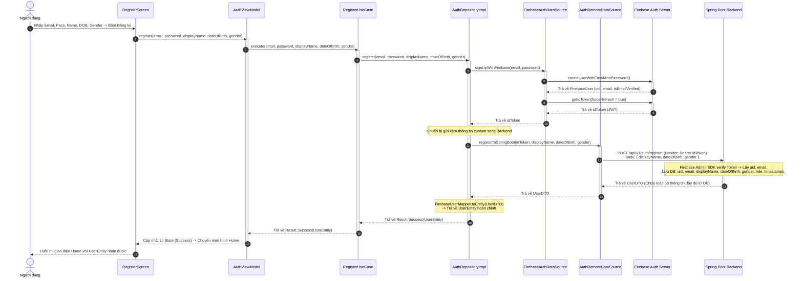

## Register

```mermaid
sequenceDiagram
    autonumber
    actor User as Người dùng
    participant UI as RegisterScreen
    participant VM as AuthViewModel
    participant UC as RegisterUseCase
    participant RepoImpl as AuthRepositoryImpl
    participant FBDataSource as FirebaseAuthDataSource
    participant RemoteDataSource as AuthRemoteDataSource
    participant FB as Firebase Auth Server
    participant SB as Spring Boot Backend

    User->>UI: Nhập Email, Pass, Name, DOB, Gender -> Bấm Đăng ký
    UI->>VM: register(email, password, displayName, dateOfBirth, gender)
    activate VM
    VM->>UC: execute(email, password, displayName, dateOfBirth, gender)
    activate UC
    UC->>RepoImpl: register(email, password, displayName, dateOfBirth, gender)
    activate RepoImpl
    
    %% Bước 1: Gọi Firebase Auth
    RepoImpl->>FBDataSource: signUpWithFirebase(email, password)
    activate FBDataSource
    FBDataSource->>FB: createUserWithEmailAndPassword()
    activate FB
    FB-->>FBDataSource: Trả về FirebaseUser (uid, email, isEmailVerified)
    deactivate FB
    
    %% Bước 2: Lấy ID Token từ Firebase
    FBDataSource->>FB: getIdToken(forceRefresh = true)
    activate FB
    FB-->>FBDataSource: Trả về idToken (JWT)
    deactivate FB
    FBDataSource-->>RepoImpl: Trả về idToken
    deactivate FBDataSource

    %% Bước 3: Đồng bộ dữ liệu sang Spring Boot Backend
    note over RepoImpl: Chuẩn bị gửi kèm thông tin custom sang Backend
    RepoImpl->>RemoteDataSource: registerToSpringBoot(idToken, displayName, dateOfBirth, gender)
    activate RemoteDataSource
    RemoteDataSource->>SB: POST /api/v1/auth/register (Header: Bearer idToken) <br/> Body: { displayName, dateOfBirth, gender }
    activate SB
    note over SB: Firebase Admin SDK verify Token -> Lấy uid, email.<br/>Lưu DB: uid, email, displayName, dateOfBirth, gender, role, timestamps.
    SB-->>RemoteDataSource: Trả về UserDTO (Chứa toàn bộ thông tin đầy đủ từ DB)
    deactivate SB
    RemoteDataSource-->>RepoImpl: Trả về UserDTO
    deactivate RemoteDataSource

    %% Bước 4: Map dữ liệu trả về UI
    note over RepoImpl: FirebaseUserMapper.toEntity(UserDTO)<br/>-> Trả về UserEntity hoàn chỉnh
    RepoImpl-->>UC: Trả về Result.Success(UserEntity)
    deactivate RepoImpl
    UC-->>VM: Trả về Result.Success(UserEntity)
    deactivate UC
    VM->>UI: Cập nhật UI State (Success) -> Chuyển màn hình Home
    deactivate VM
    UI-->>User: Hiển thị giao diện Home với UserEntity nhận được
```