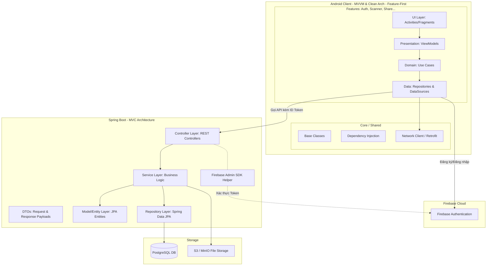
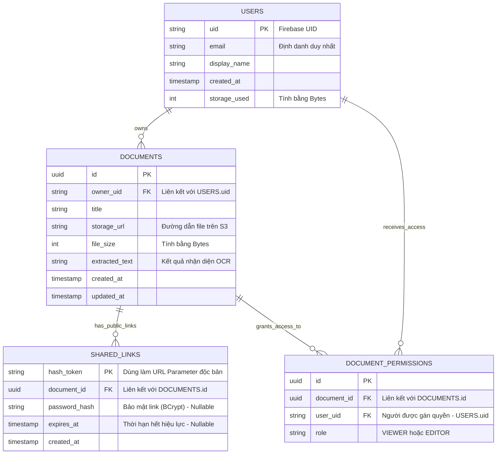
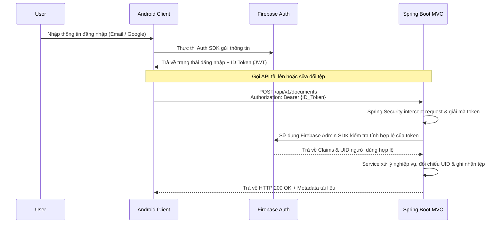

# **TÀI LIỆU ĐẶC TẢ THIẾT KẾ PHẦN MỀM (SDD)**

## **DỰ ÁN: SCANLINK (Hệ thống Quét và Quản lý Tài liệu Di động)**

**Phiên bản:** 1.2

**Tuân thủ chuẩn:** IEEE 1016-2009 (Software Design Description)

**Lịch sử chỉnh sửa**

| Tác giả | Ngày | Lý do thay đổi | Phiên bản |
| :---: | :---: | :---: | :---: |
| AI Assistant | 18/05/2026 | Khởi tạo tài liệu SDD từ BRD v4.0. Định nghĩa MVVM, Clean Architecture, Database. | 1.0 |
| AI Assistant | 18/05/2026 | Tái cấu trúc cấu trúc thư mục Android (Feature-First) và Spring Boot (MVC). | 1.1 |
| AI Assistant | Hôm nay | Nâng cấp cấu hình Spring Boot Backend lên môi trường Java 25 LTS. | 1.2 |

## **1. GIỚI THIỆU (INTRODUCTION)**

### **1.1 Mục đích (Purpose)**

Tài liệu Đặc tả Thiết kế Phần mềm (SDD) này cung cấp bản thiết kế kiến trúc tổng thể và chi tiết cho hệ thống **ScanLink**. Mục tiêu của tài liệu là dịch chuyển các yêu cầu từ tài liệu BRD/SRS thành cấu trúc kỹ thuật rõ ràng để đội ngũ lập trình (Mobile & Backend) tiến hành viết mã (coding) một cách đồng nhất.

### **1.2 Phạm vi (Scope)**

Tài liệu định nghĩa:

*   Kiến trúc hệ thống tổng thể (System Architecture) phối hợp Client-Server.
*   Mẫu thiết kế phần mềm (Android: MVVM kết hợp Clean Architecture theo Feature-First; Backend: Spring Boot MVC).
*   Cấu trúc thư mục (Folder/Package Structure) vật lý chuẩn cho cả hai nền tảng.
*   Thiết kế Lược đồ Cơ sở dữ liệu quan hệ (Database Schema) trên PostgreSQL.
*   Luồng giao tiếp hệ thống (API & Authentication Flow).

### **1.3 Thuật ngữ và Viết tắt (Glossary)**

*   **MVVM:** Model - View - ViewModel.
*   **MVC:** Model - View - Controller (Mẫu thiết kế phân tầng cho ứng dụng web/API).
*   **Feature-First:** Cách tổ chức mã nguồn gom nhóm theo tính năng thay vì phân lớp ngay tại thư mục gốc.
*   **DI (Dependency Injection):** Tiêm phụ thuộc (Sử dụng Hilt cho Android, Spring IoC cho Backend).
*   **DTO:** Data Transfer Object.
*   **JDK 25:** Java Development Kit phiên bản 25 (bản LTS thế hệ mới).

## **2. KIẾN TRÚC TỔNG THỂ (SYSTEM ARCHITECTURE)**

Hệ thống ScanLink tuân theo kiến trúc Client-Server phân tán, kết hợp công nghệ xử lý ảnh (OpenCV) offline và quản lý định danh đám mây (Firebase).



## **3. THIẾT KẾ KIẾN TRÚC THÀNH PHẦN (COMPONENT DESIGN)**

### **3.1 Android Mobile App (Kotlin) - MVVM & Clean Architecture (Feature-First)**

Kiến trúc Android Client sử dụng mô hình **Feature-First**. Các tệp nguồn được gom nhóm thành từng khối tính năng riêng biệt giúp tối ưu quy mô dự án và tránh xung đột khi làm việc nhóm. Trong mỗi tính năng, Clean Architecture vẫn được áp dụng chặt chẽ bằng cách chia ra thành 3 tầng: data, domain và presentation.

#### **Quy định cấu trúc thư mục (Directory Structure):**

``` 
com.example.scanlink/
│
├── core/                        # Chứa các thành phần dùng chung cho toàn bộ App
│   ├── base/                    # Base classes (BaseViewModel, BaseActivity...)
│   ├── di/                      # Cấu hình Dependency Injection (Hilt) toàn cục
│   ├── network/                 # Cấu hình API client (Retrofit, OkHttpClient)
│   ├── errors/                  # Xử lý Exception/Failure dùng chung
│   └── utils/                   # Các hàm extension, constants, helpers
│
└── features/                    # Chứa các tính năng chính của ứng dụng
    ├── authentication/          # Tính năng Đăng nhập/Đăng ký qua Firebase
    │   ├── data/                # [TẦNG DATA] - Lấy dữ liệu và xử lý thô
    │   │   ├── datasources/     # Gọi Firebase SDK hoặc Retrofit API (remote)
    │   │   ├── models/          # DTOs mapping trực tiếp với JSON/Firebase User
    │   │   └── repositories/    # Triển khai Repository Interface từ tầng Domain
    │   │
    │   ├── domain/              # [TẦNG DOMAIN] - Nghiệp vụ thuần túy
    │   │   ├── entities/        # Models thực thể nghiệp vụ (e.g., UserProfile)
    │   │   ├── repositories/    # Interfaces định nghĩa hành vi nghiệp vụ
    │   │   └── usecases/        # Logic nghiệp vụ đơn lẻ (e.g., LoginUseCase)
    │   │
    │   └── presentation/        # [TẦNG PRESENTATION] - Hiển thị UI
    │       ├── viewmodels/      # ViewModels lưu giữ trạng thái UI (UiState)
    │       └── ui/              # Giao diện (Activity/Fragment hoặc Compose Screens)
    │
    ├── document_scanner/        # Tính năng quét tài liệu và chỉnh sửa ảnh
    │   ├── data/                # Chứa nguồn ảnh vật lý, tích hợp OpenCV, ML Kit
    │   ├── domain/              # Chứa logic biến đổi phối cảnh, nhận dạng văn bản
    │   └── presentation/        # Giao diện Camera, giao diện căn chỉnh góc méo, bộ lọc màu
    │
    └── file_sharing/            # Tính năng tải tài liệu lên Cloud và chia sẻ file
        ├── data/                # Gọi Spring API để đẩy file, tạo link chia sẻ
        ├── domain/              # Nghiệp vụ quản lý file, thiết lập hạn dùng link
        └── presentation/        # Giao diện danh sách file, cấu hình quyền chia sẻ

```

### **3.2 Spring Boot Backend (Java 25) - MVC (Model-View-Controller) Architecture**

Kiến trúc Backend sử dụng mẫu thiết kế **MVC (Controller - Service - Repository)** truyền thống, được xây dựng trên nền tảng **Java 25 LTS** và **Spring Boot 3.5+** (bản phân phối tối ưu hóa cho Java thế hệ mới).

1.  **Controller Layer (Presentation):** Đón nhận các HTTP Request từ thiết bị di động, phân tích Header để lấy Firebase JWT Token, kiểm tra tính hợp lệ dữ liệu đầu vào (Validation) và điều phối công việc tới tầng Service.
2.  **Service Layer (Business Logic):** Chứa toàn bộ các xử lý logic nghiệp vụ của ScanLink (e.g., tính toán hạn mức dung lượng sử dụng, tạo mã băm chia sẻ không trùng lặp, cập nhật thông tin chỉnh sửa). Tận dụng tối đa cấu trúc luồng ảo hóa (Virtual Threads) từ Java 25 để tăng năng lực xử lý đồng thời.
3.  **Repository Layer (Data Access):** Thao tác trực tiếp với cơ sở dữ liệu PostgreSQL thông qua Spring Data JPA và Hibernate.
4.  **Model/Entity Layer:** Chứa các thực thể cơ sở dữ liệu (Entities) tương ứng với các bảng trong PostgreSQL và các cấu trúc dữ liệu gửi nhận (DTOs).

#### **Quy định cấu trúc thư mục (Directory Structure):**

``` 
com.example.scanlink.api
│
├── config/                 # Cấu hình Spring (Spring Security, Firebase SDK, CORS, Swagger)
│
├── controller/             # TẦNG CONTROLLER (REST Endpoints)
│   ├── DocumentController.java
│   ├── ShareController.java
│   └── UserController.java
│
├── service/                # TẦNG SERVICE (Logic nghiệp vụ)
│   ├── impl/               # Service implementations
│   │   ├── DocumentServiceImpl.java
│   │   ├── ShareServiceImpl.java
│   │   └── UserServiceImpl.java
│   ├── DocumentService.java
│   ├── ShareService.java
│   └── UserService.java
│
├── repository/             # TẦNG REPOSITORY (Data Access qua Spring Data JPA)
│   ├── DocumentRepository.java
│   ├── SharedLinkRepository.java
│   └── UserRepository.java
│
├── model/                  # TẦNG MODEL (Cấu trúc dữ liệu)
│   ├── entity/             # Các JPA Entities đại diện cho bảng CSDL
│   │   ├── Document.java
│   │   ├── SharedLink.java
│   │   └── User.java
│   └── dto/                # Data Transfer Objects trao đổi với Client
│       ├── request/        # Nhận dữ liệu (e.g., UploadRequest, ShareRequest)
│       └── response/       # Trả dữ liệu (e.g., DocumentResponse, UserResponse)
│
└── exception/              # Quản lý lỗi ngoại lệ
    ├── GlobalExceptionHandler.java
    └── CustomException.java

```

## **4. THIẾT KẾ CƠ SỞ DỮ LIỆU (DATA DESIGN)**

Hệ thống sử dụng hệ quản trị cơ sở dữ liệu **PostgreSQL** để đảm bảo tính toàn vẹn dữ liệu và hỗ trợ truy vấn quan hệ hiệu năng cao.



## **5. THIẾT KẾ GIAO TIẾP VÀ BẢO MẬT (INTERFACE & SECURITY DESIGN)**

### **5.1 Luồng Xác thực (Authentication Flow)**

Mọi yêu cầu gọi tài nguyên riêng tư trên API của Spring Boot Backend đều được xác thực và phân quyền thông qua bộ đôi Firebase Authentication và Spring Security Filter.



### **5.2 Chuẩn mực RESTful API (API Design Guidelines)**

* **Giao thức truyền tải:** Bắt buộc sử dụng HTTPS (TLS 1.3).

* **Định dạng dữ liệu:** Mặc định sử dụng JSON (application/json), ngoại trừ tính năng tải tài liệu lên sử dụng multipart/form-data.

* **Thiết kế API Endpoint (MVC Controller Mapping):**

* POST /api/v1/documents -\> DocumentController.uploadDocument(): Tải lên tài liệu mới.

* GET /api/v1/documents/{id} -\> DocumentController.getDocumentById(): Lấy thông tin tài liệu.

* POST /api/v1/shares/public -\> ShareController.createPublicLink(): Tạo đường dẫn chia sẻ công khai.

* POST /api/v1/shares/private -\> ShareController.grantPrivatePermission(): Phân quyền trực tiếp cho tài khoản khác.

**\[KẾT THÚC TÀI LIỆU ĐẶC TẢ THIẾT KẾ - SDD\]**
