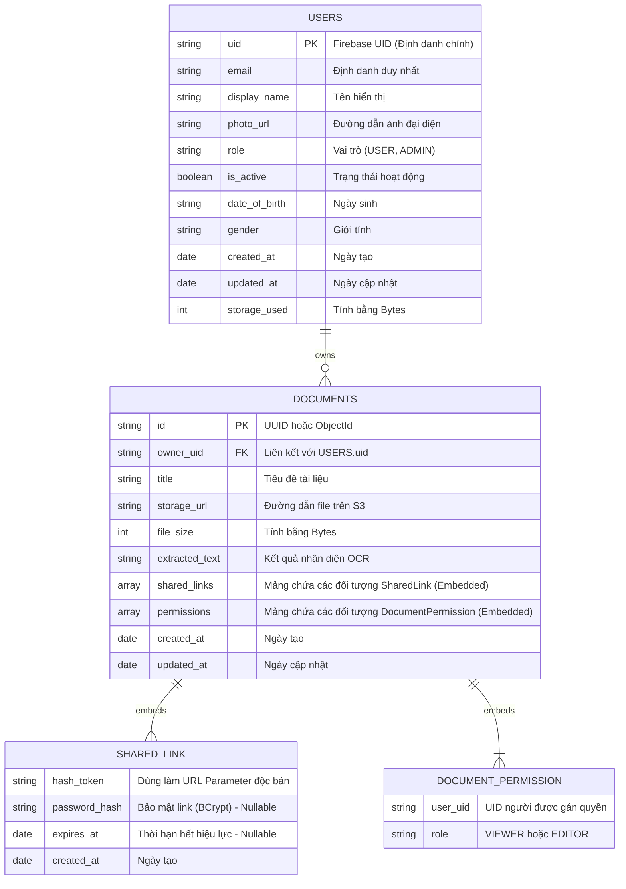
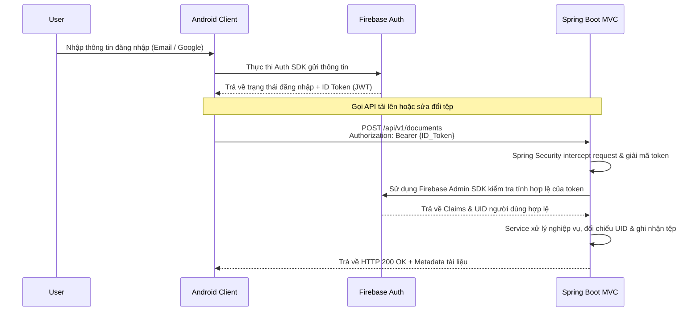

# **TÀI LIỆU ĐẶC TẢ THIẾT KẾ PHẦN MỀM (SDD)**

## **DỰ ÁN: SCANLINK (Hệ thống Quét và Quản lý Tài liệu Di động)**

**Phiên bản:** 1.4

**Tuân thủ chuẩn:** IEEE 1016-2009 (Software Design Description)

**Lịch sử chỉnh sửa**

| Tác giả | Ngày | Lý do thay đổi | Phiên bản |
| :---: | :---: | :---: | :---: |
| AI Assistant | 18/05/2026 | Khởi tạo tài liệu SDD từ BRD v4.0. Định nghĩa MVVM, Clean Architecture, Database. | 1.0 |
| AI Assistant | 18/05/2026 | Tái cấu trúc cấu trúc thư mục Android (Feature-First) và Spring Boot (MVC). | 1.1 |
| AI Assistant | Hôm nay | Nâng cấp cấu hình Spring Boot Backend lên môi trường Java 25 LTS. | 1.2 |
| AI Assistant | 24/06/2026 | Bổ sung chương Interface Design (Mục 5.2 & 5.3) đặc tả chi tiết 9 REST API endpoints theo tiêu chuẩn IEEE Std 1016-2009. | 1.3 |
| AI Assistant | 24/06/2026 | Cập nhật thiết kế dữ liệu (Data Design) và sơ đồ ERD quyết định sử dụng MongoDB. | 1.4 |

## **1. GIỚI THIỆU (INTRODUCTION)**

### **1.1 Mục đích (Purpose)**

Tài liệu Đặc tả Thiết kế Phần mềm (SDD) này cung cấp bản thiết kế kiến trúc tổng thể và chi tiết cho hệ thống **ScanLink**. Mục tiêu của tài liệu là dịch chuyển các yêu cầu từ tài liệu BRD/SRS thành cấu trúc kỹ thuật rõ ràng để đội ngũ lập trình (Mobile & Backend) tiến hành viết mã (coding) một cách đồng nhất.

### **1.2 Phạm vi (Scope)**

Tài liệu định nghĩa:

*   Kiến trúc hệ thống tổng thể (System Architecture) phối hợp Client-Server.
*   Mẫu thiết kế phần mềm (Android: MVVM kết hợp Clean Architecture theo Feature-First; Backend: Spring Boot MVC).
*   Cấu trúc thư mục (Folder/Package Structure) vật lý chuẩn cho cả hai nền tảng.
*   Thiết kế Lược đồ Cơ sở dữ liệu tài liệu (Document-oriented Database Schema) trên MongoDB.
*   Luồng giao tiếp hệ thống (API & Authentication Flow).

### **1.3 Thuật ngữ và Viết tắt (Glossary)**

*   **MVVM:** Model - View - ViewModel.
*   **MVC:** Model - View - Controller (Mẫu thiết kế phân tầng cho ứng dụng web/API).
*   **Feature-First:** Cách tổ chức mã nguồn gom nhóm theo tính năng thay vì phân lớp ngay tại thư mục gốc.
*   **DI (Dependency Injection):** Tiêm phụ thuộc (Sử dụng Hilt cho Android, Spring IoC cho Backend).
*   **DTO:** Data Transfer Object.
*   **JDK 25:** Java Development Kit phiên bản 25 (bản LTS thế hệ mới).

## **2. KIẾN TRÚC TỔNG THỂ (SYSTEM ARCHITECTURE)**

Hệ thống ScanLink tuân theo kiến trúc Client-Server phân tán, kết hợp công nghệ xử lý ảnh (OpenCV) offline và quản lý định danh đám mây (Firebase).


## **3. THIẾT KẾ KIẾN TRÚC THÀNH PHẦN (COMPONENT DESIGN)**

### **3.1 Android Mobile App (Kotlin) - MVVM & Clean Architecture (Feature-First)**

Kiến trúc Android Client sử dụng mô hình **Feature-First**. Các tệp nguồn được gom nhóm thành từng khối tính năng riêng biệt giúp tối ưu quy mô dự án và tránh xung đột khi làm việc nhóm. Trong mỗi tính năng, Clean Architecture vẫn được áp dụng chặt chẽ bằng cách chia ra thành 3 tầng: data, domain và presentation.

#### **Quy định cấu trúc thư mục (Directory Structure):**

``` 
com.example.scanlink/
│
├── core/                        # Chứa các thành phần dùng chung cho toàn bộ App
│   ├── base/                    # Base classes (BaseViewModel, BaseActivity...)
│   ├── di/                      # Cấu hình Dependency Injection (Hilt) toàn cục
│   ├── network/                 # Cấu hình API client (Retrofit, OkHttpClient)
│   ├── errors/                  # Xử lý Exception/Failure dùng chung
│   └── utils/                   # Các hàm extension, constants, helpers
│
└── features/                    # Chứa các tính năng chính của ứng dụng
    ├── authentication/          # Tính năng Đăng nhập/Đăng ký qua Firebase
    │   ├── data/                # [TẦNG DATA] - Lấy dữ liệu và xử lý thô
    │   │   ├── datasources/     # Gọi Firebase SDK hoặc Retrofit API (remote)
    │   │   ├── models/          # DTOs mapping trực tiếp với JSON/Firebase User
    │   │   └── repositories/    # Triển khai Repository Interface từ tầng Domain
    │   │
    │   ├── domain/              # [TẦNG DOMAIN] - Nghiệp vụ thuần túy
    │   │   ├── entities/        # Models thực thể nghiệp vụ (e.g., UserProfile)
    │   │   ├── repositories/    # Interfaces định nghĩa hành vi nghiệp vụ
    │   │   └── usecases/        # Logic nghiệp vụ đơn lẻ (e.g., LoginUseCase)
    │   │
    │   └── presentation/        # [TẦNG PRESENTATION] - Hiển thị UI
    │       ├── viewmodels/      # ViewModels lưu giữ trạng thái UI (UiState)
    │       └── ui/              # Giao diện (Activity/Fragment hoặc Compose Screens)
    │
    ├── document_scanner/        # Tính năng quét tài liệu và chỉnh sửa ảnh
    │   ├── data/                # Chứa nguồn ảnh vật lý, tích hợp OpenCV, ML Kit
    │   ├── domain/              # Chứa logic biến đổi phối cảnh, nhận dạng văn bản
    │   └── presentation/        # Giao diện Camera, giao diện căn chỉnh góc méo, bộ lọc màu
    │
    └── file_sharing/            # Tính năng tải tài liệu lên Cloud và chia sẻ file
        ├── data/                # Gọi Spring API để đẩy file, tạo link chia sẻ
        ├── domain/              # Nghiệp vụ quản lý file, thiết lập hạn dùng link
        └── presentation/        # Giao diện danh sách file, cấu hình quyền chia sẻ

```

### **3.2 Spring Boot Backend (Java 25) - MVC (Model-View-Controller) Architecture**

Kiến trúc Backend sử dụng mẫu thiết kế **MVC (Controller - Service - Repository)** truyền thống, được xây dựng trên nền tảng **Java 25 LTS** và **Spring Boot 3.5+** (bản phân phối tối ưu hóa cho Java thế hệ mới).

1.  **Controller Layer (Presentation):** Đón nhận các HTTP Request từ thiết bị di động, phân tích Header để lấy Firebase JWT Token, kiểm tra tính hợp lệ dữ liệu đầu vào (Validation) và điều phối công việc tới tầng Service.
2.  **Service Layer (Business Logic):** Chứa toàn bộ các xử lý logic nghiệp vụ của ScanLink (e.g., tính toán hạn mức dung lượng sử dụng, tạo mã băm chia sẻ không trùng lặp, cập nhật thông tin chỉnh sửa). Tận dụng tối đa cấu trúc luồng ảo hóa (Virtual Threads) từ Java 25 để tăng năng lực xử lý đồng thời.
3.  **Repository Layer (Data Access):** Thao tác trực tiếp với cơ sở dữ liệu MongoDB thông qua Spring Data MongoDB.
4.  **Model/Entity Layer:** Chứa các tài liệu cơ sở dữ liệu (Documents) tương ứng với các collections trong MongoDB và các cấu trúc dữ liệu gửi nhận (DTOs).

#### **Quy định cấu trúc thư mục (Directory Structure):**

``` 
com.example.scanlink.api
│
├── config/                 # Cấu hình Spring (Spring Security, Firebase SDK, CORS, Swagger)
│
├── controller/             # TẦNG CONTROLLER (REST Endpoints)
│   ├── DocumentController.java
│   ├── ShareController.java
│   └── UserController.java
│
├── service/                # TẦNG SERVICE (Logic nghiệp vụ)
│   ├── impl/               # Service implementations
│   │   ├── DocumentServiceImpl.java
│   │   ├── ShareServiceImpl.java
│   │   └── UserServiceImpl.java
│   ├── DocumentService.java
│   ├── ShareService.java
│   └── UserService.java
│
├── repository/             # TẦNG REPOSITORY (Data Access qua Spring Data MongoDB)
│   ├── DocumentRepository.java
│   └── UserRepository.java
│
├── model/                  # TẦNG MODEL (Cấu trúc dữ liệu)
│   ├── entity/             # Các Documents đại diện cho collections trong CSDL
│   │   ├── DocumentEntity.java
│   │   └── UserEntity.java
│   └── dto/                # Data Transfer Objects trao đổi với Client
│       ├── request/        # Nhận dữ liệu (e.g., UploadRequest, ShareRequest)
│       └── response/       # Trả dữ liệu (e.g., DocumentResponse, UserResponse)
│
└── exception/              # Quản lý lỗi ngoại lệ
    ├── GlobalExceptionHandler.java
    └── CustomException.java

```

## **4. THIẾT KẾ CƠ SỞ DỮ LIỆU (DATA DESIGN)**

Quyết định thiết kế hệ thống chuyển từ cơ sở dữ liệu quan hệ PostgreSQL sang cơ sở dữ liệu NoSQL **MongoDB**. Việc này giúp hệ thống lưu trữ và quản lý tài liệu linh hoạt hơn nhờ cơ chế tài liệu tự mô tả (Self-describing Document). Thay vì tách rời thành nhiều bảng và thực hiện phép nối (Join) phức tạp, cấu trúc MongoDB cho phép nhúng (embed) các thông tin liên quan như liên kết chia sẻ (Shared Links) và quyền truy cập (Permissions) trực tiếp vào trong tài liệu để tối ưu hóa tốc độ truy vấn đọc.



## **5. THIẾT KẾ GIAO TIẾP VÀ BẢO MẬT (INTERFACE & SECURITY DESIGN)**

### **5.1 Luồng Xác thực (Authentication Flow)**

Mọi yêu cầu gọi tài nguyên riêng tư trên API của Spring Boot Backend đều được xác thực và phân quyền thông qua bộ đôi Firebase Authentication và Spring Security Filter.



### **5.2 Chuẩn mực RESTful API (API Design Guidelines)**

*   **Giao thức truyền tải:** Bắt buộc sử dụng HTTPS (TLS 1.3).
*   **Định dạng dữ liệu:** Mặc định sử dụng JSON (`application/json`), ngoại trừ tính năng tải tài liệu lên sử dụng `multipart/form-data`.
*   **Cấu trúc phản hồi chuẩn (Standard Response Structure):**
    Tất cả các API đều phản hồi theo định dạng JSON thống nhất như sau:
    ```json
    {
      "status": "success" | "error",
      "message": "Thông báo chi tiết kết quả xử lý",
      "data": {} // Hoặc [] chứa đối tượng dữ liệu trả về, có thể null
    }
    ```
*   **Quy chuẩn mã phản hồi HTTP (HTTP Status Codes):**
    *   `200 OK`: Truy vấn hoặc xử lý yêu cầu thành công.
    *   `201 Created`: Tạo tài nguyên mới (tài liệu, người dùng, liên kết chia sẻ) thành công.
    *   `400 Bad Request`: Tham số đầu vào không hợp lệ hoặc sai định dạng.
    *   `401 Unauthorized`: Token xác thực (Firebase JWT) không hợp lệ hoặc đã hết hạn.
    *   `403 Forbidden`: Người dùng không có quyền truy cập hoặc thao tác trên tài nguyên này.
    *   `404 Not Found`: Không tìm thấy tài nguyên được yêu cầu.
    *   `410 Gone`: Tài nguyên không còn khả dụng (ví dụ: liên kết chia sẻ hết hạn).
    *   `413 Payload Too Large`: Kích thước tệp tải lên vượt quá giới hạn cho phép (10MB).
    *   `500 Internal Server Error`: Lỗi hệ thống backend.

### **5.3 Chi tiết Đặc tả các API Endpoints (IEEE 1016-2009 REST API Specifications)**

#### **5.3.1 Nhóm Giao diện Xác thực & Người dùng (Authentication & User Sync)**

##### **[INT-API-001] Đăng ký / Đồng bộ thông tin người dùng**
*   **Mục đích (Purpose):** Đồng bộ thông tin người dùng từ Firebase Authentication về cơ sở dữ liệu hệ thống (MongoDB). Thực hiện tạo mới nếu người dùng chưa tồn tại hoặc cập nhật thông tin mới nhất.
*   **Phương thức & Đường dẫn (HTTP Method & Path):** `POST /api/v1/auth/register`
*   **Yêu cầu Xác thực (Authentication):** Có (Firebase ID Token trong Header Authorization).
*   **Đặc tả Đầu vào (Input Specification):**
    *   **Headers:**
        *   `Authorization`: `Bearer {Firebase_ID_Token}` (Bắt buộc)
        *   `Content-Type`: `application/json`
    *   **Body:** Trống (Spring Boot sử dụng Firebase Admin SDK giải mã token lấy thông tin UID, Email, Display Name, Photo URL).
*   **Đặc tả Đầu ra (Output Specification):**
    *   **HTTP Status:** `200 OK` (Đồng bộ thành công) hoặc `201 Created` (Tạo mới người dùng thành công).
    *   **Response Body (JSON):**
        ```json
        {
          "status": "success",
          "message": "Sync thành công",
          "data": {
            "uid": "fb_uid_123456789",
            "email": "user@example.com",
            "displayName": "Nguyen Van A",
            "photoUrl": "https://lh3.googleusercontent.com/a/...",
            "role": "USER",
            "isActive": true,
            "dateOfBirth": null,
            "gender": null,
            "createdAt": "2026-06-24T15:52:44",
            "updatedAt": "2026-06-24T15:52:44"
          }
        }
        ```
*   **Kịch bản ngoại lệ (Exception Scenarios):**
    *   `401 Unauthorized`: Token Firebase không hợp lệ hoặc đã hết hạn.

##### **[INT-API-002] Xác thực Đăng nhập**
*   **Mục đích (Purpose):** Kiểm tra sự tồn tại và trạng thái hoạt động của tài khoản người dùng trong cơ sở dữ liệu sau khi ứng dụng Mobile đăng nhập Firebase thành công.
*   **Phương thức & Đường dẫn (HTTP Method & Path):** `POST /api/v1/auth/login`
*   **Yêu cầu Xác thực (Authentication):** Có (Firebase ID Token trong Header Authorization).
*   **Đặc tả Đầu vào (Input Specification):**
    *   **Headers:**
        *   `Authorization`: `Bearer {Firebase_ID_Token}` (Bắt buộc)
*   **Đặc tả Đầu ra (Output Specification):**
    *   **HTTP Status:** `200 OK`
    *   **Response Body (JSON):**
        ```json
        {
          "status": "success",
          "message": "Đăng nhập thành công",
          "data": {
            "uid": "fb_uid_123456789",
            "email": "user@example.com",
            "displayName": "Nguyen Van A",
            "photoUrl": "https://lh3.googleusercontent.com/a/...",
            "role": "USER",
            "isActive": true,
            "dateOfBirth": null,
            "gender": null,
            "createdAt": "2026-06-24T15:52:44",
            "updatedAt": "2026-06-24T15:52:44"
          }
        }
        ```
*   **Kịch bản ngoại lệ (Exception Scenarios):**
    *   `401 Unauthorized`: Token Firebase không hợp lệ hoặc hết hạn.
    *   `404 Not Found`: Tài khoản đã đăng nhập Firebase thành công nhưng chưa được đồng bộ sang cơ sở dữ liệu hệ thống (Chưa gọi API Register).
        ```json
        {
          "status": "error",
          "message": "Tài khoản không tồn tại",
          "data": null
        }
        ```

---

#### **5.3.2 Nhóm Giao diện Quản lý Tài liệu (Document Management)**

##### **[INT-API-003] Tải lên tài liệu mới**
*   **Mục đích (Purpose):** Tiếp nhận tập tin tài liệu số hóa (PDF hoặc ảnh JPEG/PNG) từ thiết bị di động, tải lên lưu trữ S3, trích xuất thông tin OCR và lưu metadata.
*   **Phương thức & Đường dẫn (HTTP Method & Path):** `POST /api/v1/documents`
*   **Yêu cầu Xác thực (Authentication):** Có (Firebase ID Token trong Header Authorization).
*   **Đặc tả Đầu vào (Input Specification):**
    *   **Headers:**
        *   `Authorization`: `Bearer {Firebase_ID_Token}` (Bắt buộc)
        *   `Content-Type`: `multipart/form-data`
    *   **Multipart Form Data Parameters:**
        *   `file` (MultipartFile, Bắt buộc): Tập tin tài liệu (Kích thước tối đa: 10MB).
        *   `title` (String, Bắt buộc): Tiêu đề tài liệu do người dùng đặt.
        *   `extractedText` (String, Tùy chọn): Nội dung chữ viết trích xuất bằng OCR offline từ thiết bị di động để lưu trữ phục vụ truy vấn tìm kiếm nhanh trên máy chủ.
*   **Đặc tả Đầu ra (Output Specification):**
    *   **HTTP Status:** `201 Created`
    *   **Response Body (JSON):**
        ```json
        {
          "status": "success",
          "message": "Tải lên tài liệu thành công",
          "data": {
            "id": "e2c34a8f-287d-41a4-94c6-e91040854d92",
            "ownerUid": "fb_uid_123456789",
            "title": "Hóa đơn mua hàng tháng 6",
            "storageUrl": "https://s3.amazonaws.com/scanlink-bucket/e2c34a8f-287d-41a4-94c6-e91040854d92.pdf",
            "fileSize": 154230,
            "extractedText": "CÔNG TY BÁN LẺ A - HÓA ĐƠN THANH TOÁN...",
            "createdAt": "2026-06-24T15:55:00",
            "updatedAt": "2026-06-24T15:55:00"
          }
        }
        ```
*   **Kịch bản ngoại lệ (Exception Scenarios):**
    *   `400 Bad Request`: Thiếu tham số bắt buộc hoặc định dạng tệp tin không hợp lệ.
    *   `413 Payload Too Large`: Kích thước tệp tin vượt quá 10MB.
    *   `401 Unauthorized`: Token Firebase không hợp lệ.

##### **[INT-API-004] Lấy danh sách tài liệu cá nhân**
*   **Mục đích (Purpose):** Lấy danh sách phân trang các tài liệu thuộc quyền sở hữu của người dùng hiện tại.
*   **Phương thức & Đường dẫn (HTTP Method & Path):** `GET /api/v1/documents`
*   **Yêu cầu Xác thực (Authentication):** Có.
*   **Đặc tả Đầu vào (Input Specification):**
    *   **Headers:**
        *   `Authorization`: `Bearer {Firebase_ID_Token}` (Bắt buộc)
    *   **Query Parameters:**
        *   `page` (Integer, Tùy chọn, Mặc định = 0): Vị trí trang dữ liệu cần lấy.
        *   `size` (Integer, Tùy chọn, Mặc định = 20): Số lượng bản ghi tối đa trên một trang.
        *   `sortBy` (String, Tùy chọn, Mặc định = "createdAt"): Trường cơ sở dữ liệu dùng để sắp xếp.
*   **Đặc tả Đầu ra (Output Specification):**
    *   **HTTP Status:** `200 OK`
    *   **Response Body (JSON):**
        ```json
        {
          "status": "success",
          "message": "Lấy danh sách thành công",
          "data": {
            "content": [
              {
                "id": "e2c34a8f-287d-41a4-94c6-e91040854d92",
                "title": "Hóa đơn mua hàng tháng 6",
                "storageUrl": "https://s3.amazonaws.com/scanlink-bucket/e2c34a8f-287d-41a4-94c6-e91040854d92.pdf",
                "fileSize": 154230,
                "createdAt": "2026-06-24T15:55:00"
              }
            ],
            "pageable": {
              "pageNumber": 0,
              "pageSize": 20
            },
            "totalElements": 1,
            "totalPages": 1,
            "last": true
          }
        }
        ```

##### **[INT-API-005] Truy vấn thông tin chi tiết tài liệu**
*   **Mục đích (Purpose):** Xem chi tiết thông tin và nội dung OCR của một tài liệu cụ thể. Chỉ cho phép chủ sở hữu tài liệu hoặc người dùng được cấp quyền truy cập.
*   **Phương thức & Đường dẫn (HTTP Method & Path):** `GET /api/v1/documents/{id}`
*   **Yêu cầu Xác thực (Authentication):** Có.
*   **Đặc tả Đầu vào (Input Specification):**
    *   **Headers:**
        *   `Authorization`: `Bearer {Firebase_ID_Token}` (Bắt buộc)
    *   **Path Variables:**
        *   `id` (UUID, Bắt buộc): Định danh duy nhất của tài liệu cần truy vấn.
*   **Đặc tả Đầu ra (Output Specification):**
    *   **HTTP Status:** `200 OK`
    *   **Response Body (JSON):**
        ```json
        {
          "status": "success",
          "message": "Lấy thông tin tài liệu thành công",
          "data": {
            "id": "e2c34a8f-287d-41a4-94c6-e91040854d92",
            "ownerUid": "fb_uid_123456789",
            "title": "Hóa đơn mua hàng tháng 6",
            "storageUrl": "https://s3.amazonaws.com/scanlink-bucket/e2c34a8f-287d-41a4-94c6-e91040854d92.pdf",
            "fileSize": 154230,
            "extractedText": "CÔNG TY BÁN LẺ A...",
            "createdAt": "2026-06-24T15:55:00",
            "updatedAt": "2026-06-24T15:55:00"
          }
        }
        ```
*   **Kịch bản ngoại lệ (Exception Scenarios):**
    *   `403 Forbidden`: Người dùng không có quyền truy cập xem tài liệu này.
    *   `404 Not Found`: Không tìm thấy tài liệu tương ứng với ID yêu cầu trong hệ thống.

##### **[INT-API-006] Xóa tài liệu**
*   **Mục đích (Purpose):** Xóa vĩnh viễn tài liệu khỏi cơ sở dữ liệu và tệp lưu trữ vật lý trên hệ thống lưu trữ S3. Chỉ chủ sở hữu tài liệu mới có quyền thực hiện.
*   **Phương thức & Đường dẫn (HTTP Method & Path):** `DELETE /api/v1/documents/{id}`
*   **Yêu cầu Xác thực (Authentication):** Có.
*   **Đặc tả Đầu vào (Input Specification):**
    *   **Headers:**
        *   `Authorization`: `Bearer {Firebase_ID_Token}` (Bắt buộc)
    *   **Path Variables:**
        *   `id` (UUID, Bắt buộc): Định danh duy nhất của tài liệu cần xóa.
*   **Đặc tả Đầu ra (Output Specification):**
    *   **HTTP Status:** `200 OK`
    *   **Response Body (JSON):**
        ```json
        {
          "status": "success",
          "message": "Xóa tài liệu thành công",
          "data": null
        }
        ```
*   **Kịch bản ngoại lệ (Exception Scenarios):**
    *   `403 Forbidden`: Người dùng không phải là chủ sở hữu và không có quyền xóa tài liệu.
    *   `404 Not Found`: Tài liệu không tồn tại trong hệ thống.

---

#### **5.3.3 Nhóm Giao diện Chia sẻ & Cộng tác (Share & Collaboration)**

##### **[INT-API-007] Tạo liên kết chia sẻ công khai**
*   **Mục đích (Purpose):** Sinh một chuỗi băm (Hash Token) duy nhất tương ứng với một liên kết truy cập tài liệu công khai. Hỗ trợ đặt mật khẩu và giới hạn thời gian tồn tại của liên kết.
*   **Phương thức & Đường dẫn (HTTP Method & Path):** `POST /api/v1/shares/public`
*   **Yêu cầu Xác thực (Authentication):** Có.
*   **Đặc tả Đầu vào (Input Specification):**
    *   **Headers:**
        *   `Authorization`: `Bearer {Firebase_ID_Token}` (Bắt buộc)
        *   `Content-Type`: `application/json`
    *   **Request Body (JSON):**
        ```json
        {
          "documentId": "e2c34a8f-287d-41a4-94c6-e91040854d92", // Bắt buộc
          "password": "my_secure_password", // Tùy chọn (Để trống nếu không cần mật khẩu)
          "expireInDays": 7 // Tùy chọn (Số ngày liên kết có hiệu lực, để trống nếu vô hạn)
        }
        ```
*   **Đặc tả Đầu ra (Output Specification):**
    *   **HTTP Status:** `201 Created`
    *   **Response Body (JSON):**
        ```json
        {
          "status": "success",
          "message": "Tạo liên kết chia sẻ thành công",
          "data": {
            "hashToken": "a8f9c10e3d2b",
            "documentId": "e2c34a8f-287d-41a4-94c6-e91040854d92",
            "expiresAt": "2026-07-01T15:55:00",
            "hasPassword": true,
            "shareUrl": "https://scanlink.com/share/a8f9c10e3d2b"
          }
        }
        ```
*   **Kịch bản ngoại lệ (Exception Scenarios):**
    *   `403 Forbidden`: Người yêu cầu không phải chủ sở hữu tài liệu và không có quyền tạo liên kết chia sẻ.
    *   `404 Not Found`: Không tìm thấy tài liệu yêu cầu chia sẻ.

##### **[INT-API-008] Phân quyền truy cập nội bộ (Account-based Share)**
*   **Mục đích (Purpose):** Phân quyền truy cập trực tiếp cho tài khoản khác đã đăng ký trên hệ thống dựa trên email để cộng tác làm việc.
*   **Phương thức & Đường dẫn (HTTP Method & Path):** `POST /api/v1/shares/private`
*   **Yêu cầu Xác thực (Authentication):** Có.
*   **Đặc tả Đầu vào (Input Specification):**
    *   **Headers:**
        *   `Authorization`: `Bearer {Firebase_ID_Token}` (Bắt buộc)
        *   `Content-Type`: `application/json`
    *   **Request Body (JSON):**
        ```json
        {
          "documentId": "e2c34a8f-287d-41a4-94c6-e91040854d92", // Bắt buộc
          "shareToEmail": "collaborator@example.com", // Bắt buộc
          "role": "VIEWER" // Chỉ nhận giá trị "VIEWER" hoặc "EDITOR" (Bắt buộc)
        }
        ```
*   **Đặc tả Đầu ra (Output Specification):**
    *   **HTTP Status:** `200 OK`
    *   **Response Body (JSON):**
        ```json
        {
          "status": "success",
          "message": "Phân quyền thành công",
          "data": {
            "documentId": "e2c34a8f-287d-41a4-94c6-e91040854d92",
            "collaboratorEmail": "collaborator@example.com",
            "role": "VIEWER"
          }
        }
        ```
*   **Kịch bản ngoại lệ (Exception Scenarios):**
    *   `403 Forbidden`: Người dùng không có quyền phân quyền truy cập cho tài liệu này.
    *   `404 Not Found`: Email người nhận chưa đăng ký tài khoản trên hệ thống ScanLink hoặc tài liệu không tồn tại.

##### **[INT-API-009] Truy cập tài liệu qua liên kết công khai**
*   **Mục đích (Purpose):** Cho phép truy cập và tải xuống tài liệu từ liên kết chia sẻ công khai mà không bắt buộc phải đăng nhập tài khoản.
*   **Phương thức & Đường dẫn (HTTP Method & Path):** `GET /api/v1/shares/public/{hash_token}`
*   **Yêu cầu Xác thực (Authentication):** Không bắt buộc.
*   **Đặc tả Đầu vào (Input Specification):**
    *   **Headers:**
        *   `Content-Type`: `application/json`
    *   **Path Variables:**
        *   `hash_token` (String, Bắt buộc): Mã băm độc bản của liên kết chia sẻ công khai.
    *   **Query Parameters:**
        *   `password` (String, Tùy chọn): Mật khẩu truy cập (Chỉ yêu cầu nếu liên kết được đặt mật khẩu bảo vệ).
*   **Đặc tả Đầu ra (Output Specification):**
    *   **HTTP Status:** `200 OK`
    *   **Response Body (JSON):**
        ```json
        {
          "status": "success",
          "message": "Truy xuất tài liệu thành công",
          "data": {
            "documentId": "e2c34a8f-287d-41a4-94c6-e91040854d92",
            "title": "Hóa đơn mua hàng tháng 6",
            "storageUrl": "https://s3.amazonaws.com/scanlink-bucket/e2c34a8f-287d-41a4-94c6-e91040854d92.pdf",
            "fileSize": 154230,
            "extractedText": "CÔNG TY BÁN LẺ A..."
          }
        }
        ```
*   **Kịch bản ngoại lệ (Exception Scenarios):**
    *   `401 Unauthorized`: Tài liệu yêu cầu mật khẩu nhưng mật khẩu đầu vào bị sai hoặc để trống.
        ```json
        {
          "status": "error",
          "message": "Sai mật khẩu truy cập",
          "data": null
        }
        ```
    *   `410 Gone`: Liên kết chia sẻ đã hết hạn sử dụng.
        ```json
        {
          "status": "error",
          "message": "Liên kết chia sẻ đã hết hạn",
          "data": null
        }
        ```
    *   `404 Not Found`: Liên kết chia sẻ không tồn tại trên hệ thống.

**[KẾT THÚC TÀI LIỆU ĐẶC TẢ THIẾT KẾ - SDD]**
