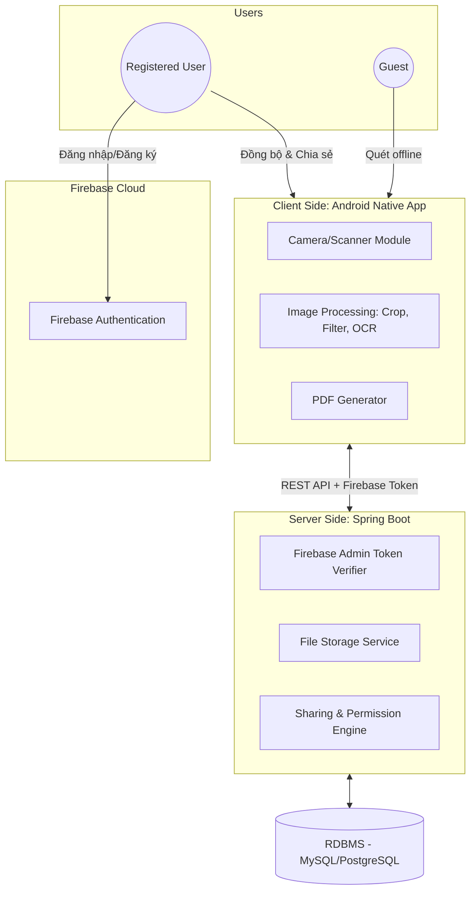
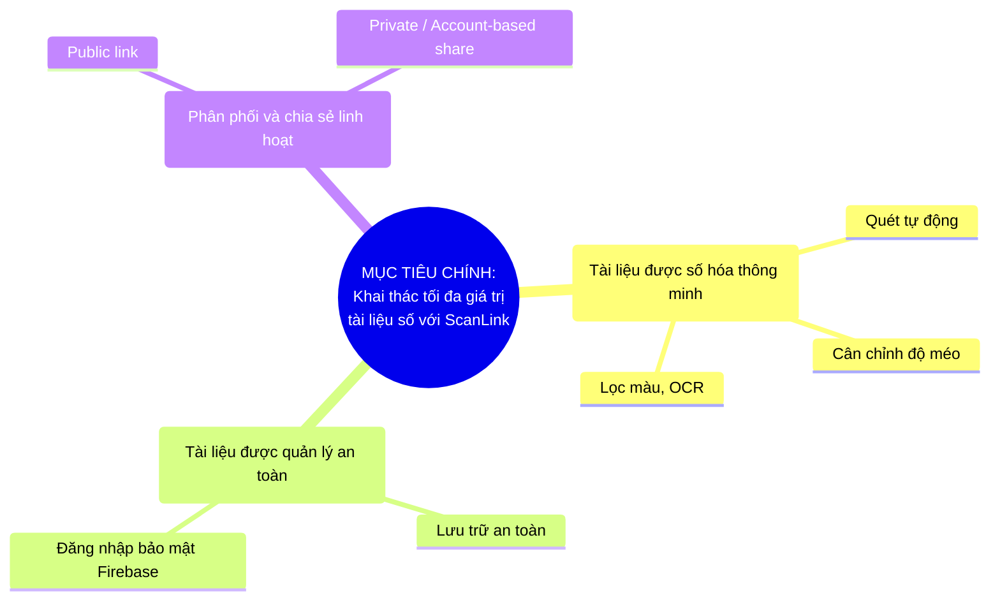
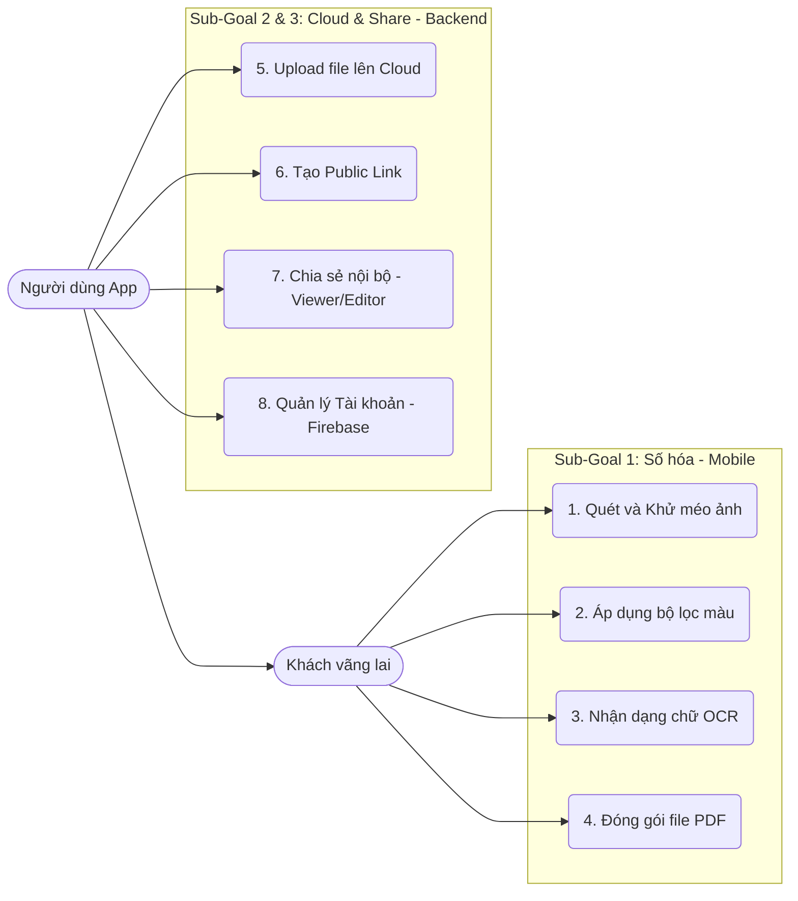

# TÀI LIỆU YÊU CẦU NGHIỆP VỤ (BRD)

## HỆ THỐNG QUÉT VÀ QUẢN LÝ TÀI LIỆU DI ĐỘNG (SCANLINK)

**Phiên bản: 4.0 (Dựa trên khung chuẩn dự án EIP\_SCC - Cập nhật tên dự án & Firebase)**

**Lịch sử chỉnh sửa**

| **Tác giả**  | **Ngày**   | **Lý do thay đổi**                                             | **Giai đoạn** | **Phiên bản** |
| :----------: | :--------: | :------------------------------------------------------------: | :-----------: | :-----------: |
| Võ Văn Thiệt | 18/05/2026 | Khởi tạo tài liệu theo khung EIP\_SCC                          | Draft         | 1.0           |
| AI Assistant | 18/05/2026 | Tái cấu trúc, thêm biểu đồ Mermaid và Sub-goals                | Development   | 2.0           |
| AI Assistant | 18/05/2026 | Bổ sung Ràng buộc công nghệ, Hệ điều hành, Thư viện (Mục 1.10) | Development   | 2.1           |
| AI Assistant | 18/05/2026 | Đổi tên dự án thành ScanLink, Tích hợp Firebase Auth           | Development   | 2.2           |

## 1\. GIỚI THIỆU (INTRODUCTION)

### 1.1 Mục đích và Phạm vi (Purpose and Scope)

Tài liệu này cung cấp tập hợp các yêu cầu cốt lõi nhằm phát triển hệ thống **ScanLink**. Hệ thống bao gồm một ứng dụng di động Native (Kotlin/Java) để quét/xử lý tài liệu và một nền tảng Cloud Backend (Spring Boot) để lưu trữ, quản lý và chia sẻ tệp tin bảo mật.

Phạm vi tài liệu bao gồm: quản lý vòng đời tài liệu số, yêu cầu chức năng (nhóm theo Use Case), yêu cầu phi chức năng và kiến trúc phân quyền dữ liệu.

### 1.2 Bối cảnh (Context)

Sự gia tăng nhu cầu số hóa giấy tờ trong kỷ nguyên số đòi hỏi một công cụ di động mạnh mẽ, có khả năng xử lý ảnh (Edge-AI) ngay trên thiết bị và đồng bộ hóa an toàn lên Cloud. Hệ thống này giúp phá vỡ rào cản chia sẻ thông tin cục bộ, cung cấp cơ chế phân quyền chuẩn mực cho các tệp PDF/Văn bản.

### 1.3 Đối tượng độc giả (Intended Audience)

* **Đội ngũ phát triển (Developers):** Kỹ sư Mobile (Android Native) và Kỹ sư Backend (Spring Boot).
* **Quản lý dự án (Project Managers):** Theo dõi tiến độ và đối chiếu tính năng.
* **Đội kiểm thử (QA/QC):** Xây dựng kịch bản kiểm thử (Test cases).

### 1.4 Cách sử dụng tài liệu (How to Use this Document)

Tài liệu được cấu trúc theo định hướng Mục tiêu (Goal-oriented). Người đọc nên bắt đầu từ Mục 2 để nắm bắt Mục tiêu Tổng thể, sau đó đi sâu vào từng Sub-goal, các Use Case tương ứng và bảng Đặc tả Yêu cầu kỹ thuật.

### 1.5 Định nghĩa và Tiêu chuẩn (Definitions, Standards)

* **OCR (Optical Character Recognition):** Công nghệ nhận diện ký tự quang học.
* **Firebase Authentication:** Dịch vụ xác thực người dùng (BaaS) của Google, quản lý an toàn quy trình đăng ký, đăng nhập và cấp phát ID Token.
* **RBAC (Role-Based Access Control):** Kiểm soát truy cập dựa trên vai trò.

### 1.6 Phạm vi sản phẩm và Viễn cảnh (Product Scope and Perspective)

Hệ thống là một kiến trúc mở, phục vụ việc thu thập, xử lý và phân phối tài liệu số.

### 1.7 Ngăn xếp phát triển nền tảng (The Development Stack)

* **Nhu cầu xã hội (Societal Needs):** Cung cấp công cụ số hóa tài liệu cá nhân nhanh chóng, bảo mật.
* **Dịch vụ & Kinh doanh (Services & Business Models):** Dịch vụ chia sẻ file an toàn, mô hình Freemium (Miễn phí tính năng quét, trả phí để tăng dung lượng lưu trữ Cloud).
* **Dữ liệu thành phố/Người dùng (Data):** Đảm bảo tính toàn vẹn (Integrity), metadata chuẩn, lưu trữ trên các định dạng mở.
* **Hạ tầng (Infrastructure):** Nền tảng phân tán, kết hợp Firebase (Auth) và máy chủ độc lập cho logic nghiệp vụ (Spring Boot).

### 1.8 Lớp người dùng và Quyền truy cập (User Classes and Access)

| **Lớp người dùng**          | **Đặc điểm và Quyền hạn**                                                                               |
| :-------------------------: | :-----------------------------------------------------------------------------------------------------: |
| **Khách vãng lai (Guest)**  | Sử dụng các tính năng offline của app (quét, sửa, lưu nội bộ trên máy). Không cần tài khoản.            |
| **Người dùng (Registered)** | Được cấp không gian lưu trữ Cloud, đồng bộ dữ liệu, tạo link Public và chia sẻ tài liệu cho người khác. |
| **Quản trị viên (Admin)**   | Giám sát lưu lượng, quản lý cấu hình hạn mức (Quota), phân quyền hệ thống.                              |

### 1.9 Tài liệu người dùng (User Documentation)

* **Tài liệu API (API Specs):** Sử dụng Swagger/OpenAPI 3.0 để đặc tả toàn bộ RESTful API cho ứng dụng di động giao tiếp với Backend.
* **Cẩm nang người dùng (User Guide):** Hướng dẫn tích hợp ngay trong lần đầu mở ứng dụng (Onboarding screens).

### 1.10 Ràng buộc thiết kế và triển khai (Design and Implementation Constraints)

Phần này định nghĩa nghiêm ngặt các ranh giới kỹ thuật nhằm đảm bảo tính đồng nhất trong quá trình phát triển.

#### 1.10.1 Môi trường hoạt động (Operating Environment)

* **Thiết bị di động:** Hệ điều hành Android (API Level tối thiểu: 26 - Android 8.0 Oreo trở lên).
* **Máy chủ Backend:** Hỗ trợ chạy trên môi trường Linux (Ubuntu 22.04 LTS hoặc CentOS 9), container hóa bằng Docker.
* **Môi trường Java:** Yêu cầu Java Development Kit (JDK) 17 LTS (Amazon Corretto hoặc Eclipse Temurin) cho cả quá trình compile Android và Backend.

#### 1.10.2 Ràng buộc Ngôn ngữ và Framework (Languages & Frameworks)

* **Ứng dụng di động (Client):**
  * Ngôn ngữ chính: **Kotlin (v1.9+)**. Hỗ trợ mã nguồn kế thừa (legacy code) bằng Java 17 nếu cần.
  * Kiến trúc: MVVM (Model-View-ViewModel) kết hợp Clean Architecture.
* **Backend (Server):**
  * Framework: **Spring Boot (v3.2+)**.
  * ORM: Hibernate 6.x (thông qua Spring Data JPA).
* **Cơ sở dữ liệu (Database):**
  * Relational DB: **PostgreSQL (v15+)** lưu trữ metadata, profile người dùng, phân quyền chia sẻ.

#### 1.10.3 Thư viện cốt lõi (Core Libraries)

* **Module xử lý ảnh (Computer Vision):**
  * OpenCV for Android (v4.8+): Xử lý ma trận ảnh, phát hiện cạnh (Edge detection), chuyển đổi phối cảnh (Perspective Transform) và lọc màu (Binarization, Grayscale).
  * Google ML Kit (Vision v16.1+): Xử lý nhận dạng chữ viết (On-device OCR) để trích xuất văn bản offline.
* **Module Camera:**
  * AndroidX CameraX (v1.3+): Điều khiển vòng đời camera, tự động lấy nét và trích xuất Frame với hiệu năng cao.
* **Module tạo PDF:**
  * iText 7 hoặc Android PdfDocument API: Gắn ảnh đã xử lý vào định dạng chuẩn PDF/A.
* **Module Xác thực & Network (Authentication & Network):**
  * Firebase Authentication SDK (Android): Xử lý quy trình Đăng ký, Đăng nhập, Đăng xuất, Reset mật khẩu và cấp phát ID Token trực tiếp trên ứng dụng.
  * Firebase Admin SDK (Spring Boot): Tích hợp cùng Spring Security để giải mã và xác thực Firebase ID Token do Client gửi lên trong các header request.
  * Retrofit2 (v2.9+) & OkHttp3: Xử lý giao tiếp HTTP/REST từ phía Android.

### 1.11 Giả định (Assumptions)

* Ứng dụng giả định thiết bị Android có camera tối thiểu 8.0 Megapixels để tính năng OCR hoạt động ổn định.
* Dữ liệu hình ảnh thô sau khi quét sẽ bị xóa tạm thời (Clear Cache) sau khi đã xuất thành công ra PDF để tối ưu bộ nhớ máy.

## 2\. TUYÊN BỐ GIÁ TRỊ, USE CASES VÀ YÊU CẦU CHỨC NĂNG

### 2.1 Từ Tuyên bố Giá trị đến Đặc tả Nền tảng (Value Proposition)

Tài liệu sử dụng mô hình hóa định hướng mục tiêu (goal-oriented). Mục tiêu chính là cung cấp nền tảng quản lý tài liệu số toàn diện.

### 2.2 Sơ đồ Use Case Tổng quan

### 2.3 SUB-GOAL 1: Tài liệu được số hóa thông minh

* **Mô tả:** Đảm bảo quá trình đầu vào (từ camera đến bản scan PDF) dễ dàng, độ chính xác cao.
* **Động lực (Drivers):** Tối ưu hóa trải nghiệm người dùng cuối, giảm thiểu thao tác thủ công, tận dụng Edge-AI.

**Bảng Yêu cầu chức năng - Nhóm Số hóa:**

| **Req. ID** | **UC ID** | **Mô tả Yêu cầu**                                                                                     | **Độ ưu tiên** | **Phạm vi (Domain)** |
| :---------: | :-------: | :---------------------------------------------------------------------------------------------------: | :------------: | :------------------: |
| FREQ.1      | UC1       | Tự động phát hiện viền tài liệu từ Camera stream (sử dụng OpenCV, đạt \> 30 FPS).                     | Must           | Mobile Client        |
| FREQ.2      | UC1       | Cho phép kéo 4 góc neo, áp dụng thuật toán getPerspectiveTransform để làm phẳng ảnh.                  | Must           | Mobile Client        |
| FREQ.3      | UC2       | Cung cấp các bộ lọc màu chuẩn: Original, Magic Color (tăng nét), Grayscale, B\&W (Thresholding).      | Must           | Mobile Client        |
| FREQ.4      | UC3       | Trích xuất ký tự (OCR) bằng ML Kit offline đạt độ chính xác \>95% (Tiếng Anh/Việt), hỗ trợ copy text. | Should         | Mobile Client        |
| FREQ.5      | UC4       | Gom nhóm nhiều ảnh để xuất thành 1 file PDF, cho phép chọn chất lượng nén (Low/Med/High).             | Must           | Mobile Client        |

### 2.4 SUB-GOAL 2: Tài liệu được quản lý an toàn

* **Mô tả:** Hệ thống tiếp nhận, lưu trữ tài liệu lên Cloud một cách toàn vẹn và quản lý định danh người dùng bảo mật thông qua Firebase.
* **Động lực:** Bảo vệ thông tin tài khoản và an toàn lưu trữ dữ liệu.

**Bảng Yêu cầu chức năng - Nhóm Quản lý:**

| **Req. ID** | **UC ID** | **Mô tả Yêu cầu**                                                                                                                                                                                                | **Độ ưu tiên** | **Phạm vi (Domain)** |
| :---------: | :-------: | :--------------------------------------------------------------------------------------------------------------------------------------------------------------------------------------------------------------: | :------------: | :------------------: |
| FREQ.6      | UC5       | Backend cung cấp API Upload dạng Multipart (Spring Web) với luồng tải lên được tối ưu hóa.                                                                                                                       | Must           | Spring Boot          |
| FREQ.7      | UC5       | Đổi tên file vật lý trên đĩa cứng thành UUID để chống Path Traversal/Dò quét trực tiếp.                                                                                                                          | Must           | Spring Boot          |
| FREQ.8      | UC5       | Đồng bộ hóa dữ liệu (Offline-first): Lưu hàng đợi ở local (Room DB) nếu mất mạng, tự động upload khi có Internet.                                                                                                | Should         | Mobile + Backend     |
| FREQ.9      | UC8       | Tích hợp **Firebase Authentication** cho các tính năng Đăng ký, Đăng nhập, Đăng xuất (hỗ trợ Email/Pass, Google Sign-in). Backend sử dụng Spring Security kết hợp Firebase Admin SDK để xác minh Firebase Token. | Must           | Mobile + Spring Boot |

### 2.5 SUB-GOAL 3: Tài liệu được phân phối / chia sẻ linh hoạt

* **Mô tả:** Dữ liệu có thể được truy xuất và chia sẻ tuỳ theo ý muốn của chủ sở hữu (Owner).
* **Động lực:** Tăng khả năng làm việc cộng tác và tương tác giữa các user.

**Bảng Yêu cầu chức năng - Nhóm Chia sẻ:**

| **Req. ID** | **UC ID** | **Mô tả Yêu cầu**                                                                                                               | **Độ ưu tiên** | **Phạm vi (Domain)** |
| :---------: | :-------: | :-----------------------------------------------------------------------------------------------------------------------------: | :------------: | :------------------: |
| FREQ.10     | UC6       | Tạo đường dẫn chia sẻ Public (Public Link) kèm Hash token bảo mật.                                                              | Must           | Spring Boot          |
| FREQ.11     | UC6       | Hỗ trợ gán mật khẩu và thiết lập thời hạn hết hạn (Expiration Date) cho Public Link.                                            | Should         | Spring Boot          |
| FREQ.12     | UC7       | Chia sẻ nội bộ theo Account (Email). Cấp quyền linh hoạt: Viewer (Chỉ xem/tải) hoặc Editor (Cập nhật bản mới).                  | Must           | Spring Boot          |
| FREQ.13     | UC7       | Ngăn chặn truy cập trái phép: API trả về 401 Unauthorized nếu Firebase Token hết hạn hoặc 403 Forbidden nếu sai quyền truy cập. | Must           | Spring Boot          |

## 3\. YÊU CẦU PHI CHỨC NĂNG (NON-FUNCTIONAL REQUIREMENTS)

### 3.1 Yêu cầu Chất lượng Run-time (Run-time Quality)

* **Hiệu năng & Tốc độ (Scalability/Performance):**
  * Tác vụ xử lý ảnh (Khử méo, lọc màu) trên thiết bị di động phải hoàn tất \< 1.5 giây cho ảnh 12MP.
  * Độ trễ phản hồi API của Spring Boot Backend phải \< 200ms với tải thông thường.
* **Tính khả dụng (Availability):**
  * Uptime của hệ thống Backend yêu cầu tối thiểu 99.9%.
  * Dịch vụ Firebase Auth có tính khả dụng độc lập theo SLA của Google.
  * Giao diện người dùng trên App đảm bảo nguyên tắc Material Design 3 (luồng quét đến lưu file PDF không quá 4 bước chạm).
* **Bảo mật & Quyền riêng tư (Security & Privacy):**
  * Mọi truyền tải dữ liệu Client - Server đều qua HTTPS (TLS 1.3).
  * Backend không lưu trữ mật khẩu trực tiếp, hoàn toàn ủy quyền định danh cho Firebase Authentication.

### 3.2 Yêu cầu Phi Run-time (Non Run-time Quality)

* **Khả năng mở rộng (Evolvability/Extensibility):** Backend thiết kế theo kiến trúc module, hỗ trợ mở rộng tích hợp S3 Object Storage (AWS/MinIO) sau này mà không cần đập bỏ mã nguồn hiện tại.

### 3.3 Danh sách NFR (List of Non-Functional Requirements)

| **ID**  | **Yêu cầu (Description)**                                                  | **Quan tâm (Concern)** | **Ưu tiên** | **Domain** |
| :-----: | :------------------------------------------------------------------------: | :--------------------: | :---------: | :--------: |
| NFREQ.1 | Giao diện hỗ trợ Dark/Light mode chuẩn Material Design 3.                  | Usability              | Should      | Mobile     |
| NFREQ.2 | Thời gian cold start của app di động \< 2 giây.                            | Performance            | Must        | Mobile     |
| NFREQ.3 | API hỗ trợ phân trang (pagination) và lọc để tránh quá tải payload.        | Scalability            | Must        | Backend    |
| NFREQ.4 | Tích hợp công cụ giám sát lỗi (Crashlytics) và ghi log server (ELK Stack). | Observability          | Should      | Cả hai     |

## 4\. YÊU CẦU KHÁC (OTHER REQUIREMENTS)

### 4.1 Định dạng dữ liệu hỗ trợ (Supported Data Formats)

| **Loại (MIME type)** | **Mô tả định dạng**                                | **Extension** | **Mức độ**   |
| :------------------: | :------------------------------------------------: | :-----------: | :----------: |
| application/pdf      | Portable Document Format (File xuất bản cuối cùng) | .pdf          | Hỗ trợ chính |
| image/jpeg           | File ảnh gốc từ camera                             | .jpg, .jpeg   | Hỗ trợ chính |
| text/plain           | Dữ liệu văn bản trích xuất từ tính năng OCR        | .txt          | Hỗ trợ       |
| application/json     | Giao thức trao đổi dữ liệu REST API                | .json         | Hỗ trợ       |

## 5\. KẾT LUẬN VÀ KẾ HOẠCH TIẾP THEO (CONCLUSION & FORWARD PLANS)

*Sẽ được cập nhật ở pha lập kế hoạch Sprint (Sprint Planning Phase)*.
